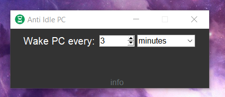

# Anti-Idle-PC
**Anti Idle PC** app is designed to prevent your computer from going idle by simulating key presses at regular intervals. This helps to keep your PC awake and active, ensuring that it does not enter sleep mode or lock itself due to inactivity. The app allows you to customize the interval and unit of time for the simulated key presses, providing flexibility to suit your needs.

[Download Anti Idle PC](https://github.com/JohanFire/Anti-Idle-PC/releases/tag/v1.0)

